# Module 1: Create a canvas app with Copilot in Power Apps

## Lab Scenario

In this exercise, you'll take on the role of a software developer tasked with creating a user-friendly canvas app using Power Apps Copilot. Your objective is to build an app designed to manage customer information effectively. Start by using Copilot to quickly generate a table with essential columns such as Customer ID, Full Name, Email, and Phone Number. Then, populate the table with sample data and make necessary adjustments, such as modifying column data types. Finally, design the app's interface to display and interact with the data, test its functionality, and publish the app for user access. This lab will showcase how Power Apps Copilot can streamline app development and enhance productivity.

## Lab objectives

In this lab, you will complete the following tasks:

- Task 1 – Create Power Platform environment.
- Task 2 - Create an app with Copilot.
- Task 3 - Make edits using Copilot to edit your app.


### Task 1 – Create Power Platform environment

 In this task, you'll create and configure a new Power Platform environment to support app development and deployment. You'll set up essential details and adjust settings to meet your organizational needs.
 
1. Open a new browser tab and navigate to the Power Platform admin center by copying and pasting the following link:

   ```
   https://aka.ms/ppac
   ```

2. On **Sign into Microsoft Azure** tab you will see login screen, in that enter following email/username and then click on **Next**. 
   * Email/Username: <inject key="AzureAdUserEmail"></inject>

      

3. Now enter the following password and click on **Sign in**.
   * Password: <inject key="AzureAdUserPassword"></inject>
   
       

4. In the site navigation, click on **Manage (1)**, click on **Environments (2)**, and then click **+ New (3)** on the toolbar.

   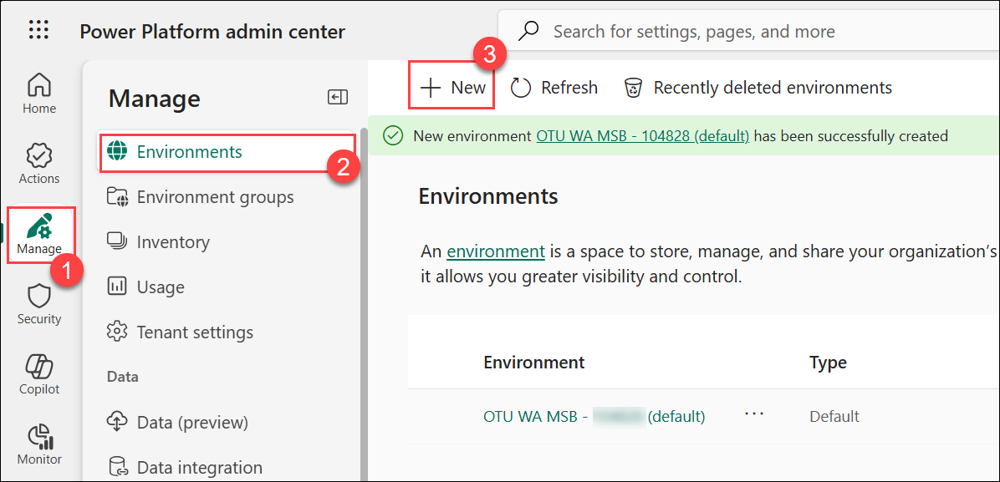 

5. Create a new Environment with the following settings:

   - **Type**: **Sandbox (1)**
   - **Region**: **United States - Default (2)**
   - **Name**: **Copilot (3)**
   - Expand **Change default settings (4)**
   - **Add a Dataverse data store?**: **Yes (5)**
   - Keep all other settings unchanged, Click on **Next (6)**
   
      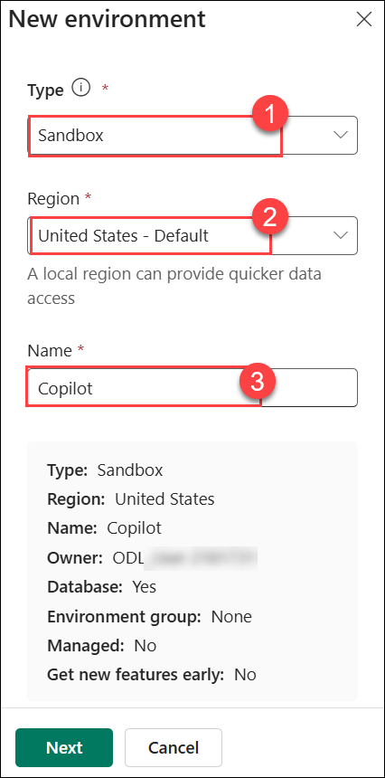

      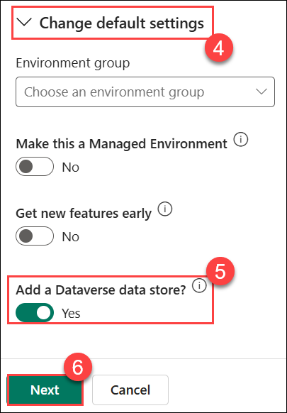  
 
6. On the **Add Dataverse** tab, under **Security Group**, click the **+ Select** button. Then, under **Open Access**, choose **None (1)** and click **Done (2)**.

   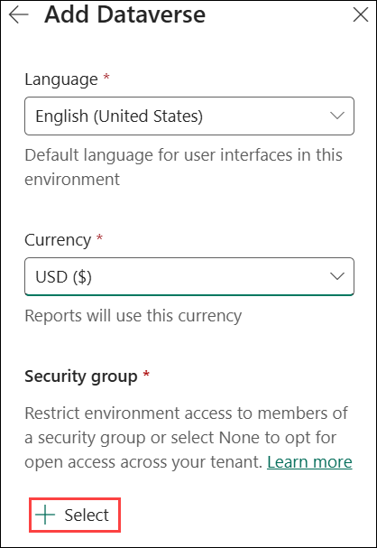

   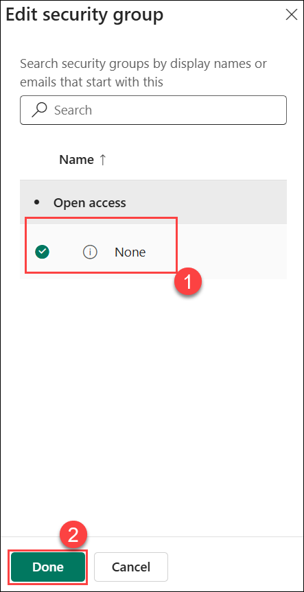

7. Select **Save (2)**, on the **Add Dataverse** prompt.

   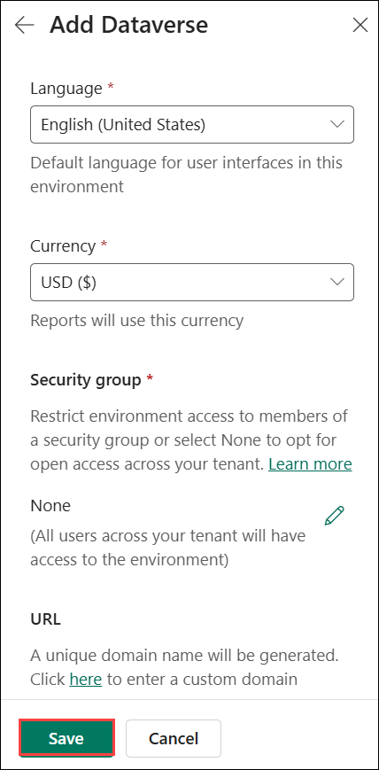
 
8. In the list of environments, your **Copilot** environment should now show as **Preparing**.

   

      >**Note**:Your practice environment will take a few minutes to provision. Refresh the **Environments** list if needed.
 
9. When your environment shows as **Ready**, select your **Copilot** environment by selecting the ellipses next to the name to expand the drop-down menu and select **Settings**.
 
      >**Note**: Browse through the various sections under **Settings** that interest you, but refrain from making any modifications.

## Task–02: Create an app with Copilot.

In this task, you'll use Power Apps Copilot to quickly create a canvas app, including generating and populating tables with data. You'll then design the app interface and test its functionality.

1. Open a new browser tab and navigate to [https://make.powerapps.com](https://make.powerapps.com) to access Power Apps.

   >**Note:** Make sure you are in the **Copilot** environment that you created in the previous task.

      .png)

1. On the **Power Apps** portal, from the left navigation menu, select **Apps (1)**. Now, inside the Apps pane, select **+ New app (2)** drop-down, and select **Start with data (3)** option.

   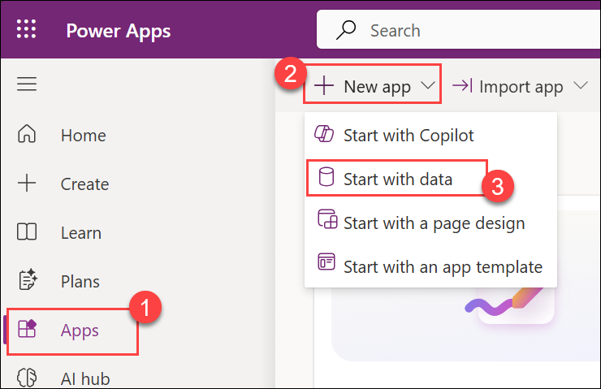

1. On the **Start with data** page, Enter the following prompt to search for an AI-generated table **build an app to manage real estate showings (1)** , Select the **Send (2)** button.

    

   >**Note:** Select **Got it** on the pompt.

1. It will generate three tables: **Property**, **Agent**, **Client** and **Showing**. However, we only need a single table named **RealEstateShowings**, which includes all four. To do this, select **Table Options** under the Copilot pane.

   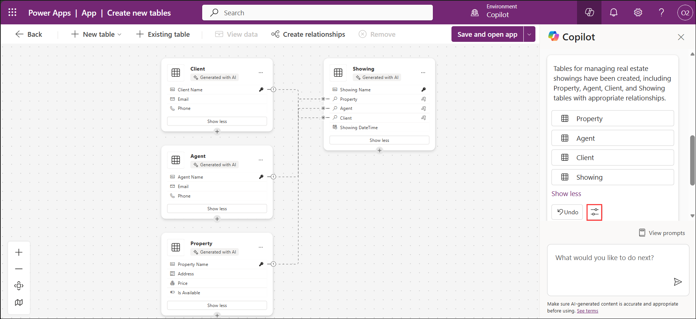

1. Under **Table options**, select **One table (1)** and then click **Apply (2)**. This will generate the required table for this lab.

   .png)

   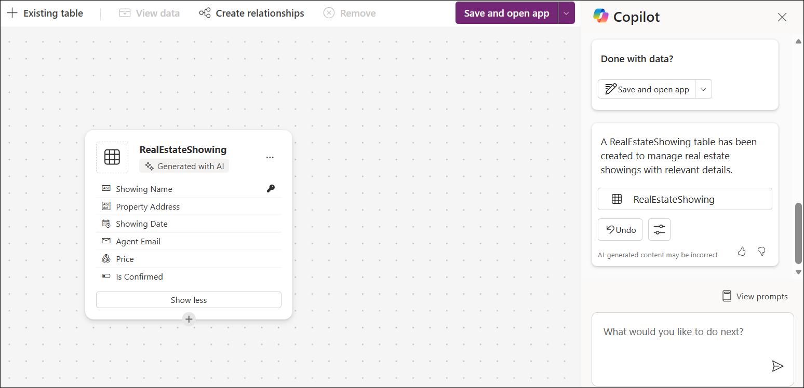

1. Once Copilot AI generates a table based on your prompt, review the tables to see the columns that have been created initially.

   

1. In the text box at the bottom of the Copilot pane on the right side of the screen, type the following text: **add a column to track client full name**. Then, click the Send button.

   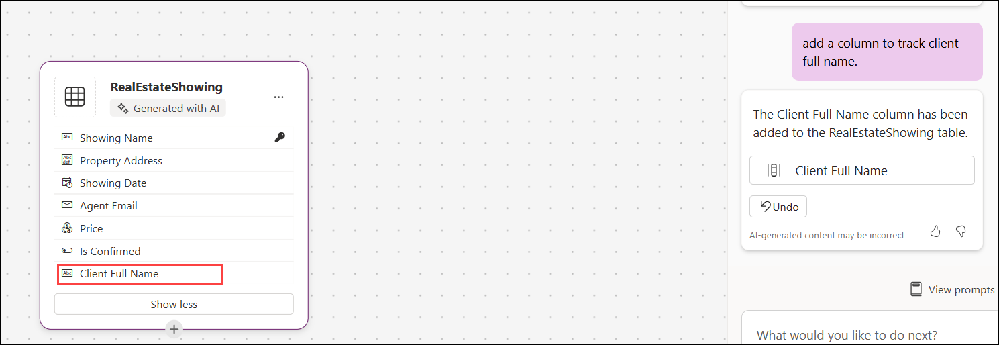

   >**Note**: Copilot notifies you that the table is updated, and the new column should show as being added to the tables.

1. If you want to check the data or columns of the table, select the **ellipses (1)** icon on the **Real Estate Showing** table and choose **View data (2)**. From here, you can rename, delete, update, and add the required columns.

   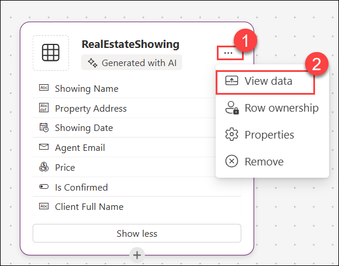
   
1. Enter the following text: **add a column to track client email**. Then, click the Send button.

   >**Note**:

   > The data that's generated in your table might vary from the data that's shown in the table in the screenshots for this lab.
   
   > The Suggestions section in the lower-left corner of the screen provides you with different suggestions on how you can add to and modify your table.

      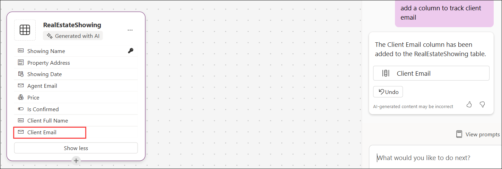

1. Enter the following text:	**add an option for “Completed” to the Status column**. Select the Send button.

   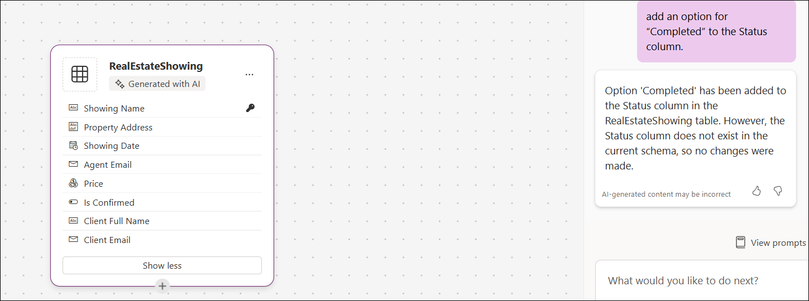

1. Enter the following text in the Copilot pane text box: **add 5 more rows of data in all the three tables**, Click **Send**. This action will insert five new rows of data for each existing column in your table.

    .png)

1. In the text box, in the lower part of the Copilot pane to the right of the screen, enter the following text: **add a column to track Client Address**. Select the **Send** button. 

   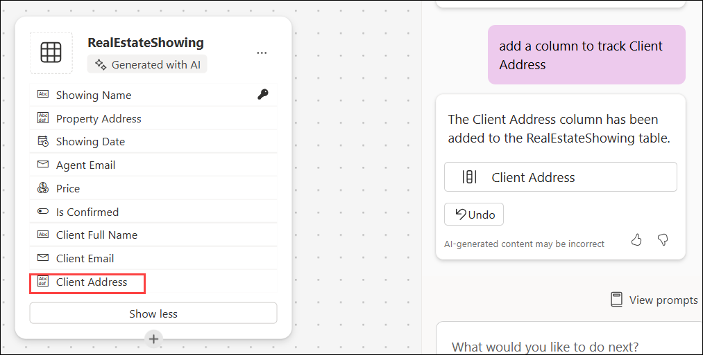

1. In the text box, in the lower part of the Copilot pane to the right of the screen, enter the following text: **add a column to track ID of the RealEstateShowing table**. Select the **Send** button.

   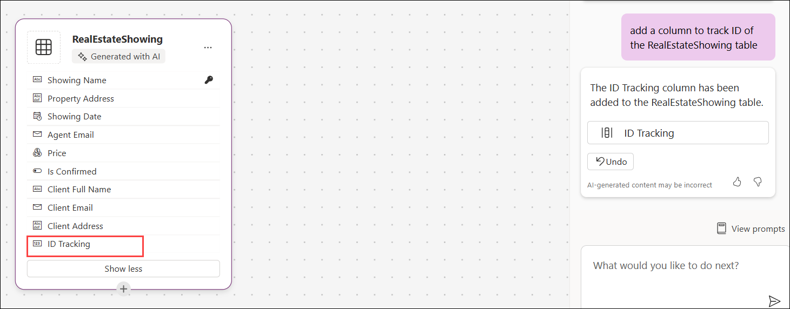

1. Select the **ellipses (1)** icon on the **Real Estate Showing** table and choose **View data (2)**.

   

1. Make sure your table looks similar to the image below.

   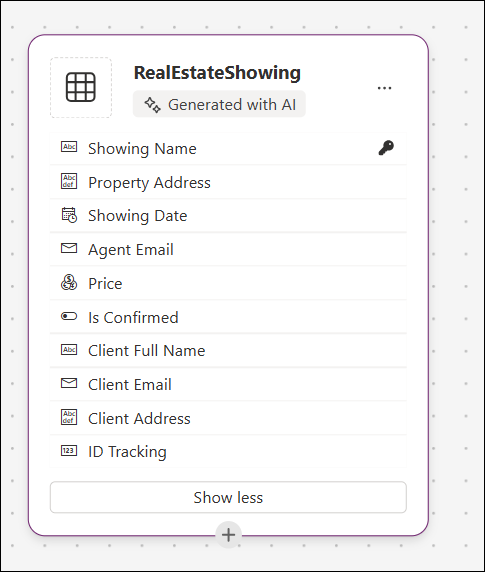

1. Select **Save and open app** twice to open the app.

      

      >**Note**: Your table may have several columns. Consider removing any columns that you do not plan to use:The list of columns that you need are: **ID, Address, Date, Status, Agent Name, Client Full Name, Client Email.**

      >**Note**: When you first open the app, you might see a welcome message.just click the **Skip** button.

1. The app that has been built for you should show in **Edit** mode.

    


## Task–03: Make edits using Copilot to edit your app.

In this task, you'll use Power Apps Copilot to make edits to your app, such as modifying existing elements, adding new features, and adjusting data. Copilot will guide you through streamlining and enhancing your app’s functionality and design.

1. On the **RealEstateShowings screen (1)**, select **RecordsGallery1 (2)** to display Real Estate Showings and then select the **Title1 (3)** and then set the Text value to the following formula: **ThisItem.'Client Address' (4)**.

   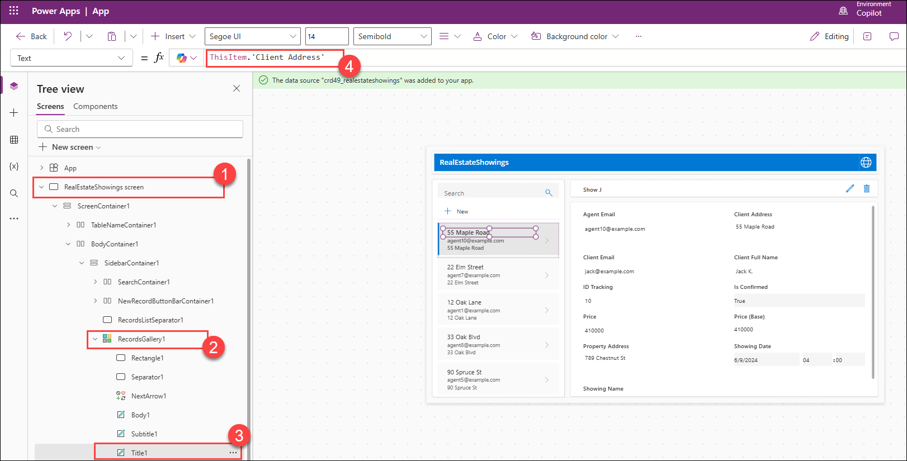
  
1. Select the **Subtitle1 (1)** and then set the Text value to the following formula: **ThisItem.'Client Email' (2)**.
    
1. Select the **Body1 (1)** and then set the Text value to the following formula: **ThisItem.'Status' (2)**

1. A single record in the gallery should now resemble the following image.

   

1. On the app's main screen, select the **Form control**.

   

1. On the **Form1 (1)**, open the **Edit fields (2)** drop-down, expand the **ID tracking (3)** field and under **Control type (4)**, select **View text (5)**.

   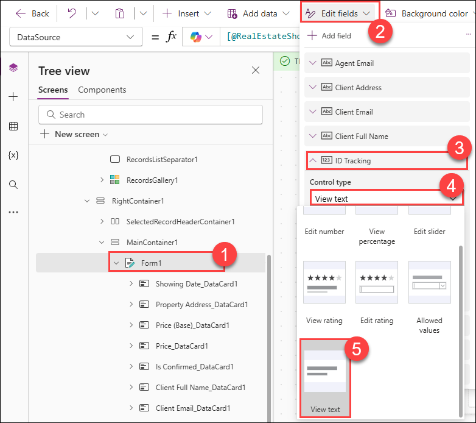

1. Make a new request for a property that shows in the app by selecting the **Play** button from the upper part of the screen.

    

1. In the left pane, select the **+ New** button.

    

1. Though you could modify the form to automatically fill in the fields for you, for this lab, you'll complete this step manually to observe how the app works.

    

1. Fill in the fields with the following information:

   - Agent Email - < Your name >

   - Client Full Name - < Your name >

   - Client Email - < Your email >

   - Showing Date - < Any future date >

   - Time - < Any future time >

   - Is Confirmed - < True >

   - Client Address - 210 Pine Road, Portland, OR 97204

      >**Note** : This address is one of the addresses from the Microsoft Excel file in Module 1, and it's the same file that you uploaded and turned into the Real Estate Properties table.Though you'd usually have a lookup field to the Real Estate Properties table, this lab doesn't provide one to keep it simple.

      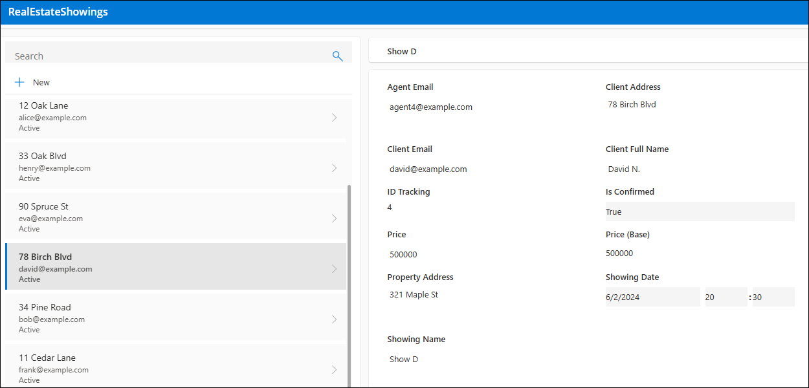

1. Select the check mark in the upper-right corner of the screen.

1. Select the X in the upper-right corner to close out of the app.

   

1. If a dialog appears saying Did you know?, select OK.

1. The new request is added to the left of the list of requests.

1. From the upper part of your screen, select the Save button to save the new app that you created.

      

1. If the system prompts you, save the app name as Real Estate Showings.

1. Exit the app to return to the Power Apps home page.

## Summary 

In this lab, you have accomplished the following:

- You have set up and configured a new Power Platform environment to support app development.
- You have used Copilot to quickly build a canvas app and add data.
- You have refined and modified the app’s design and functionality with Copilot’s assistance.

### Congratulations! you have successfully completed this lab, please click on **Next** to continue with the next lab.

