# Module 3: Build a basic Power Automate flow in Microsoft Copilot Studio

## Lab scenario

In this exercise, you'll build a basic Power Automate flow using Microsoft Copilot Studio. You'll begin by launching Copilot Studio and selecting the option to create a new flow. Following Copilot's guidance, you'll set up a simple workflow by defining a trigger (such as receiving an email or a new item in a list) and configuring actions (like sending a notification or updating a record). After configuring the flow, you’ll test it to ensure it performs the desired tasks correctly. This lab will demonstrate how to use Copilot Studio to streamline the creation and deployment of automated workflows.

## Lab objectives

In this lab, you will complete the following tasks:

- Task 01 : Create a new topic.
- Task 02 : Create your Power Automate flow.
- Task 03 : Connect a Power Automate flow with Microsoft Copilot Studio.


### Task 01: Create a new topic

In this task, you'll create a new topic in Power Automate to help organize and manage your flows. You’ll navigate to the Topics section, set up a descriptive name for the topic, and categorize relevant flows under it, enhancing workflow management and organization.

1. Open a new tab, copy and paste the following link to open **Microsoft Copilot Studio**. On the **Welcome to Microsoft Copilot Studio** page, select **United States** under **Choose your country/region**, and then click **Start free trial**.

   ```
   https://copilotstudio.microsoft.com/
   ```

1. Select the **Copilot** Environment which you created in the previous lab.

   

1. To create a new agent click on **Create an agent** then click on **Skip to Configure**.

   

1. On the **Agent** page, select **Edit**, and enter the name as **Check Weather (1)** and then select **Save (2)**.
   
   

1. On the **Check Weather** page, select **Settings**.

   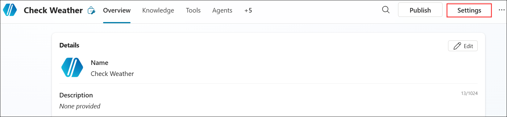

1. On the **Generative AI (1)**, under the **Orchestration** select **No - Use classic orchestration, limiting responses to the content and behavior defined in your agent's topics. (2)** and close the **Settings** page.   

   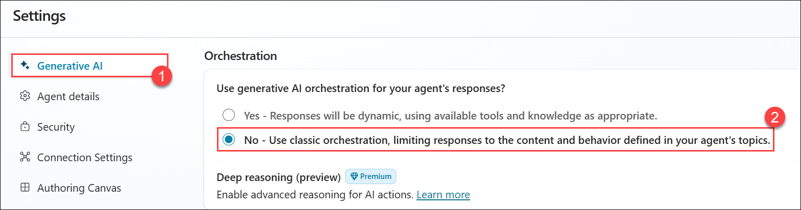
	
1. Select the **Topics (1)**. Click on **+ Add a topic (2)** and then choose an option **From blank (3)**. 

   

1. Go to **Details (1)** options to Enter **Check Weather (2)** as the name of your topic. Click on **Save (3)**.

   

1. Click on **Edit (1)** within *Phrases* to open the pane on the right side of the screen, where you can enter simple trigger phrases such as **What is the weather (2)**. After adding prompts like **What is the temperature today**, **Will it rain today**, **Is it snowing** and **How hot is it**, click **+ (3)** after each entry until you have at least five trigger phrases.

   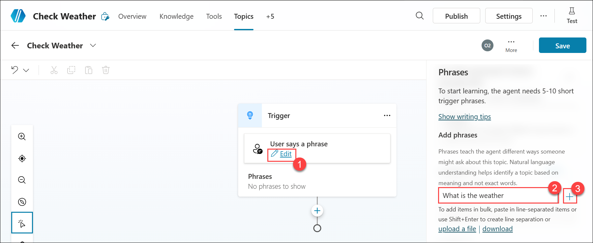

   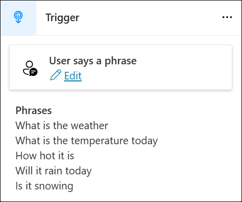

1. Now **Add a node (1)** and select the **Ask a question (2)** node.

   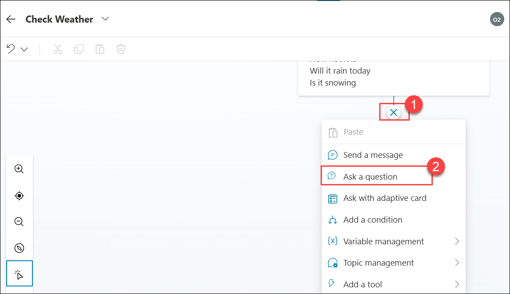

1. On the **Ask a question** node, under **Identify**, select **User’s entire response (1)**. Then, select **Save user response as (2)** and update the **Variable name** to **Region (3)**.

   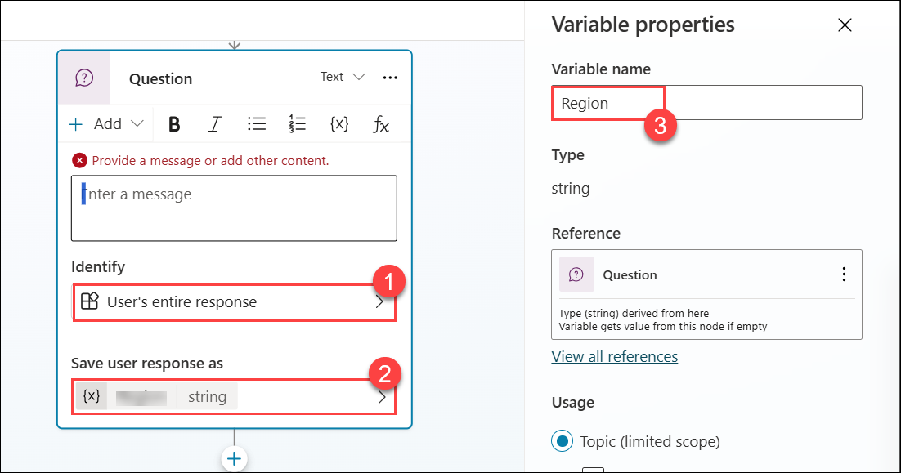

1. Then add text such as:
`Of course, I can share the weather with you! Can you tell me the name of the region where you want to know the weather?`

   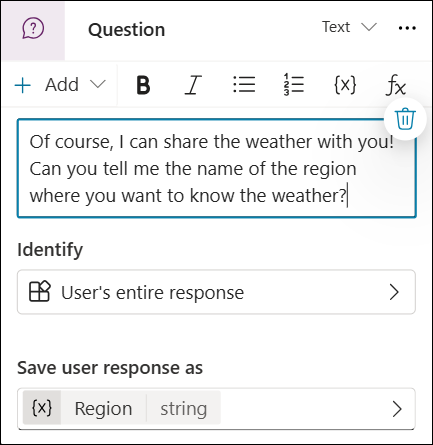

1. Within the top right corner of the screen, select the **Save** button to ensure that your work is saved.

## Task 02: Create your Power Automate flow.

In this task, you'll create a Power Automate flow to automate a specific process. You'll start by defining a trigger to initiate the flow, then set up actions to execute tasks based on the trigger. The goal is to streamline and automate repetitive processes, improving efficiency and productivity. 

1. Select the **Add node** button below the question node to add a new node to the topic. Select **Add an tool (1) > New Agent flow (2)**. The flow opens in a new browser window.

   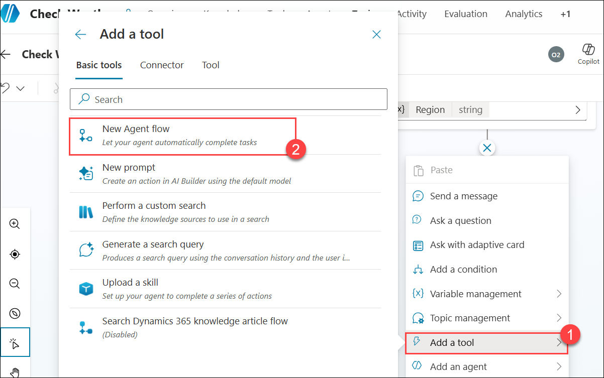

1. Click on the first node **When an agent calls the flow**, a new flow window will open, select the **Add an input** within the first scaffolded action. Then, select **Text**.

   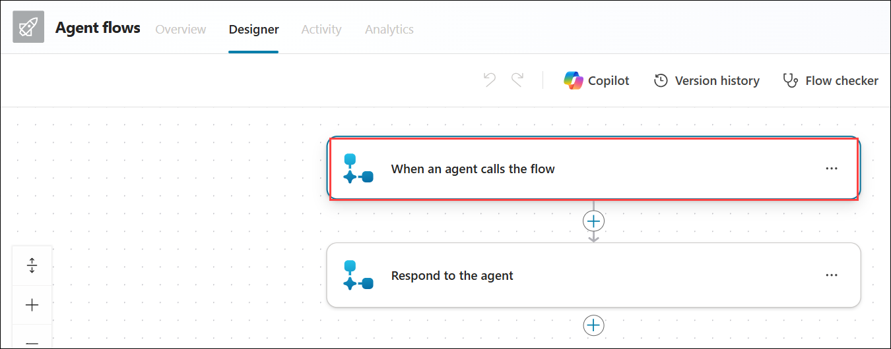
       
   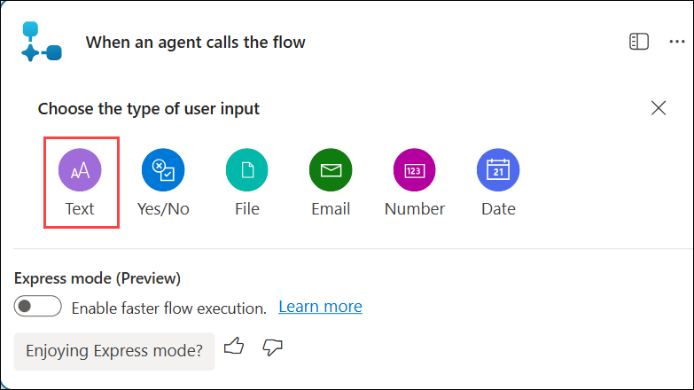

1. Within the first column, enter `Region` leaving the second column empty.

   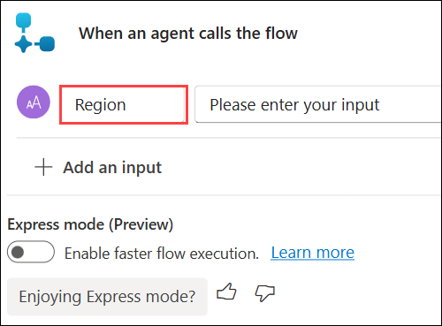

1. Then, select the **Insert a new action** button to add an action.

   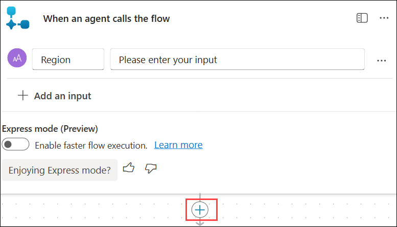

1. Enter `weather` in the search bar and then select **Get current weather** under the **MSN Weather**.
    
   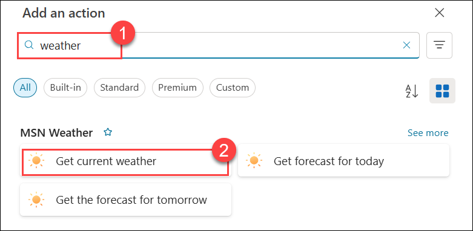

1. Under the **Get current weather** node click on the **Create new** button.

   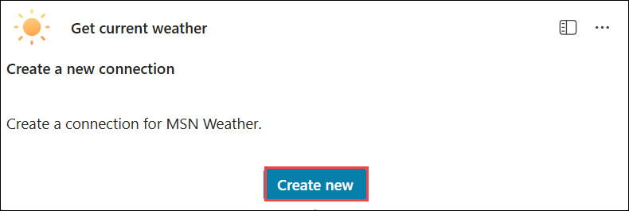

1. A new node appears, where you can enter the **Location**, use **Dynamic content (1)** menu select **Region (2)** and keep units as **Imperial**.

   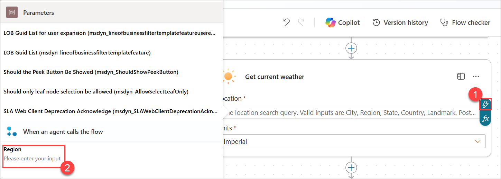

   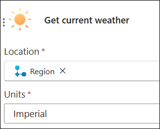

1. Select the **Respond to Copliot** node at the end of the flow, then select **Add an output > Number**.

   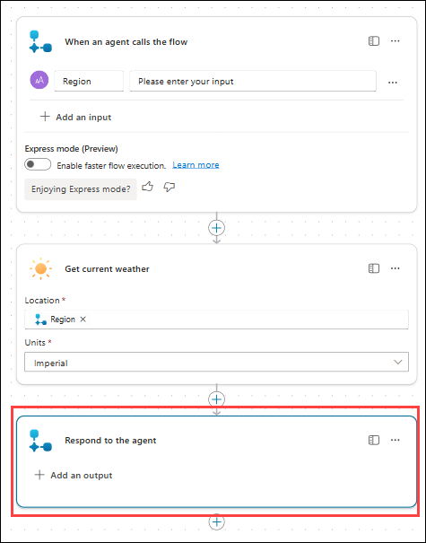

1. Place your cursor in the **Enter a value to respond (1)** text box select **Insert dynamic content (2)** search for **Temperature (3)** and select **Temperature (4)** in the Title field.

   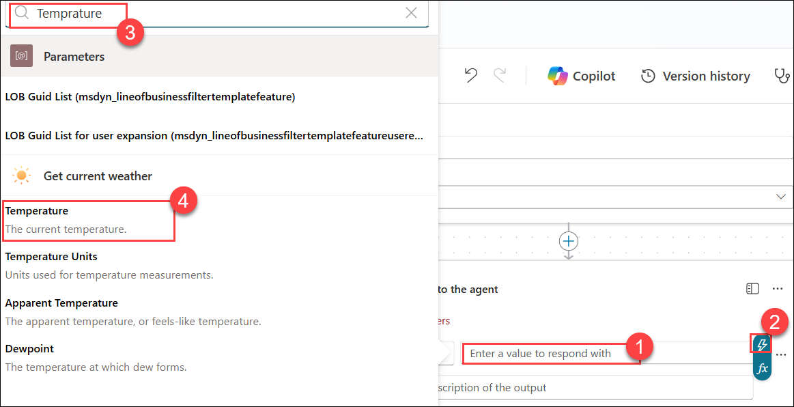

1. The flow is almost complete, select the template title and rename it to `Get Temperature` **(1)**.

1. Select **Save draft (2)** on the flow in Power Automate to ensure that it saves. Wait a moment until the green banner appears, indicating success then Select **Publish (3)**.

   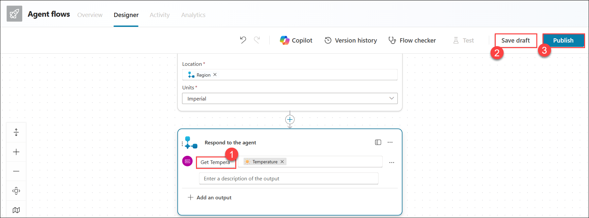

1. On the **Your agent flow published successfully** pop-up select **Go back to agent**

   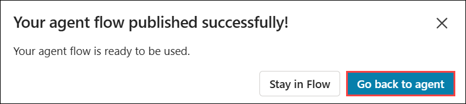

## Task 03 : Connect a Power Automate flow with Microsoft Copilot Studio.

In this task, you'll connect a Power Automate flow with Microsoft Copilot Studio. You'll start by integrating your flow into Copilot Studio, allowing Copilot to assist in configuring and enhancing the flow. This connection enables streamlined automation and leverages Copilot’s capabilities to optimize and refine the flow’s functionality.

1. In this task, you will connect a Power Automate flow with Microsoft Copilot Studio.

1. In the **Check Weather** agent, a new action will be automatically created.

   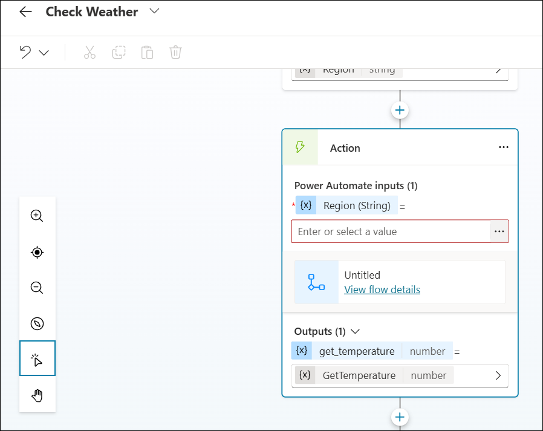

   >**Note**: If the flow does not show up, save the Check Weather topic and refresh the page.

1. Under the **Power Automate inputs** select the **Ellipses** of **Enter or select a value (1)** and then select the **Region (2)** variable that you created in previous steps of this lab. 

   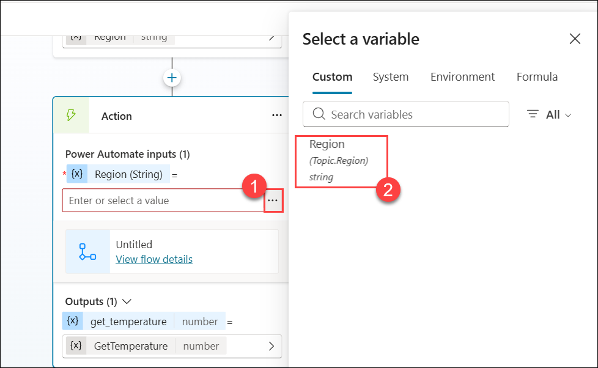

1. **Add a Condition node** so that you can check if the **Temperature (1)** variable is greater than **75 (2)**.

   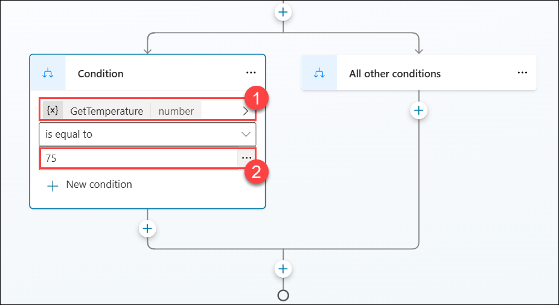

1. Under the **Conditions** node, add a new node and select **Send a message** for the true branch, if the Temperature is greater than 75, add the following text within the Message node: `For {Topic.Region} the temperature is {Topic.Temperature} and that is getting warm! Consider cooling off with one of our cold brew coffees.`

   >**Note**: The braces { } are variables to display dynamic data. To enter variables into the node, use the {X} button on the Message node and then select a variable from the list.

      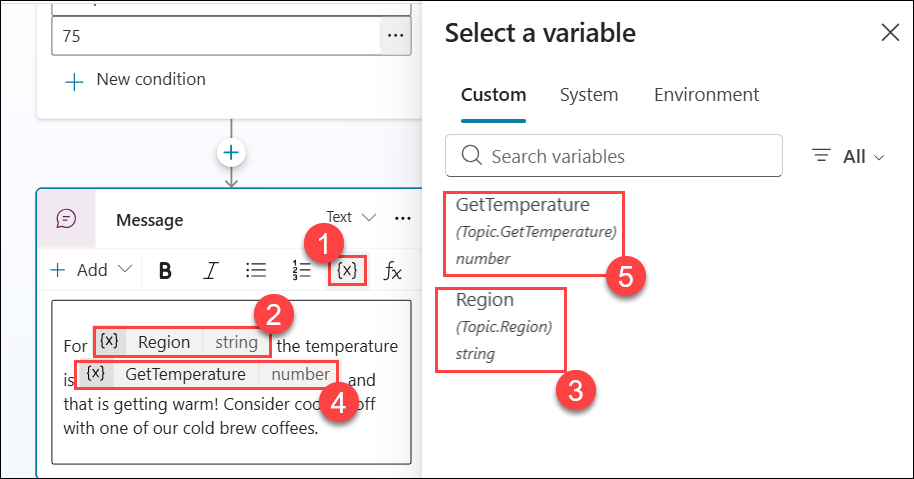

1. For the **All other conditions** node, add a new node and select the **Send a message** within the node: **The temperature for `{Topic.Region}` is `{Topic.Temperature}`. Where the braces { } are variables to display dynamic data.**

   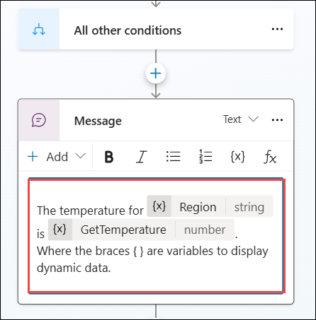

   >**Note**: The braces { } are variables to display dynamic data. To enter variables into the node, use the {X} button on the Message node and then select a variable from the list.

1. The **Condition** node should look like the screenshot below.

   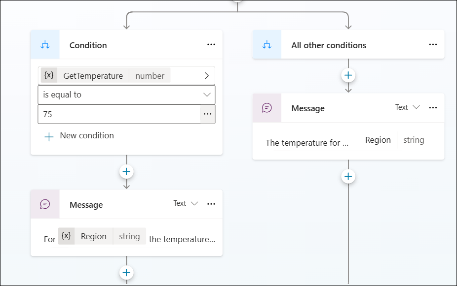

1. To end the conversation, select the **Add node** button below the condition. Select **Topic management (1)** and then choose **End conversation (1)**.

    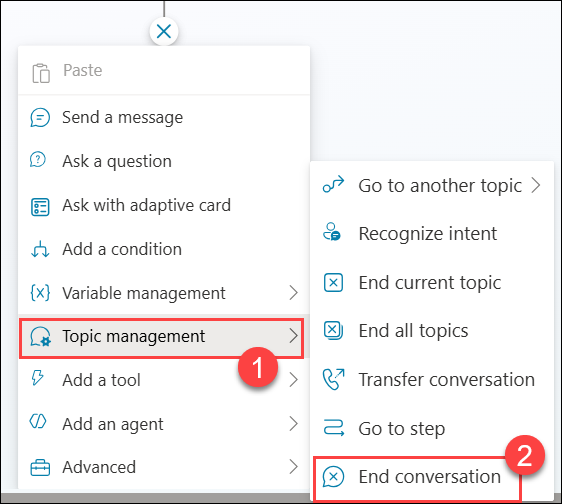

1. **Save** your topic using the button found in the top right corner of the screen and then Click on **Test** and test it out 

   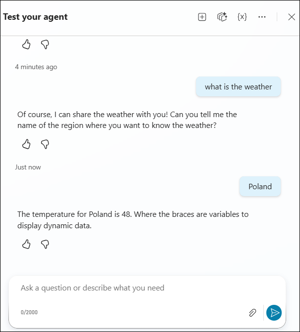

   >**Note:** If you get a response **Let's get you connected first, and then I can find that info for you. ​`Open connection manager`​ to verify your credentials. Once the connection is ready, retry your request.**

   > Select **Open connection manager**, it will navigate you to the new tab.

   > On the **Manage your connection** page, select **Connect** button.

   > On the **Create or pick connections** page, select **MSN Weather** and select **Submit**.

   >Now, navigate back to the **Topics** page, and select **Retry**.
	
1. You successfully created a Power Automate flow and a new topic in Microsoft Copilot Studio that used the flow to provide real-time data from an external service to the user.

## Summary 

In this lab, you have accomplished the following:

- You have created a new topic to organize and categorize your workflows effectively.
- You have built a Power Automate flow to automate a specific process.
- You have connected the flow with Microsoft Copilot Studio to leverage its capabilities for improved configuration and optimization.

### Congratulations! you have successfully completed this lab, please click on **Next** to continue with the next lab.
  
