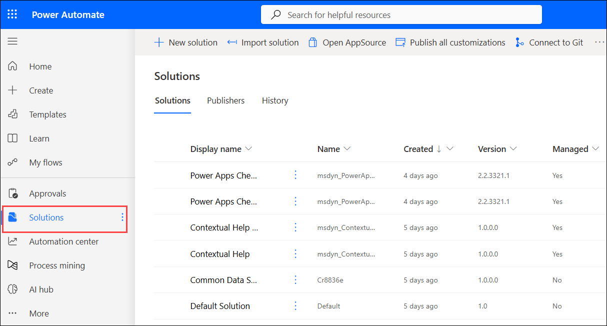
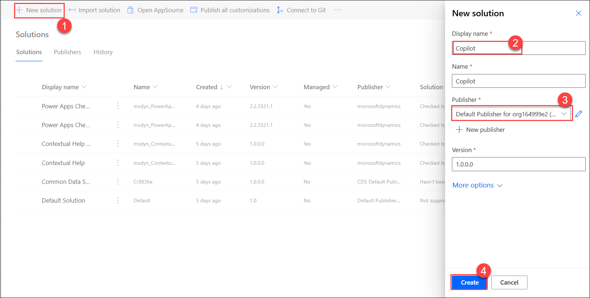
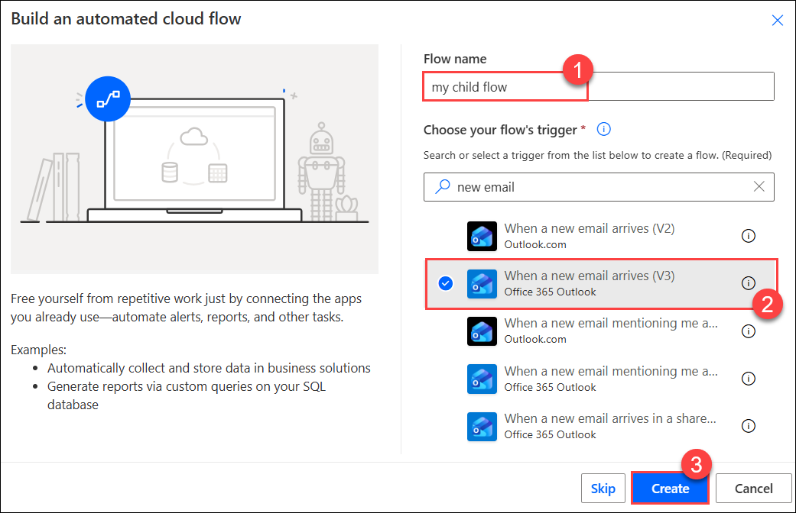
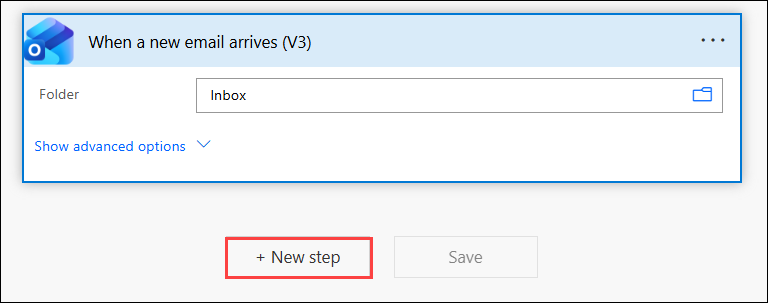
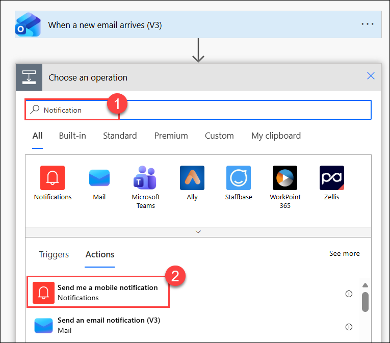
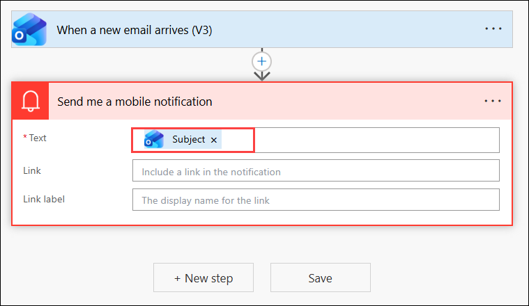
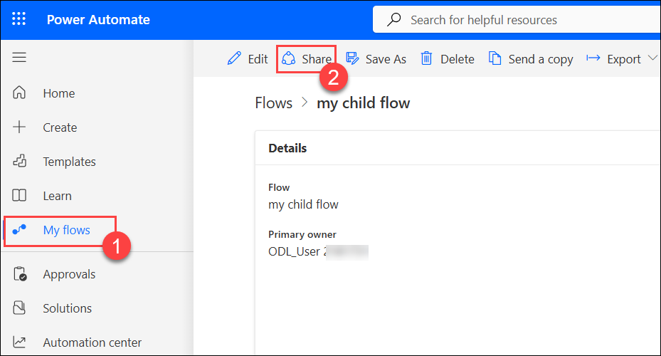

# Module 5: Share a cloud flow

## Lab scenario

In this exercise, you will share a cloud flow with others using Microsoft Power Automate. Start by accessing the cloud flow you wish to share in the Power Automate portal. Use the sharing options to grant access to specific users or groups, setting their permissions appropriately. This process will allow collaborators to view, edit, or manage the flow as needed, enabling effective teamwork and workflow management. This lab will demonstrate how to manage and share cloud flows to enhance collaboration and productivity.

## Lab objectives

In this lab, you will complete the following tasks:

- Task 01: Create A cloud Flow
- Task 02: Add an owner to a cloud flow
- Task 03: Send a copy of a cloud flow

## Task 01: Create A cloud Flow

In this task, you'll create a cloud flow in Power Automate to automate a specific process. You'll start by defining a trigger that initiates the flow, then configure actions and conditions to perform the desired tasks. This setup will streamline workflows and improve efficiency by automating repetitive or routine tasks.

1. Open a new tab, and sign into **Power Automate** using the following link:

     ```
     https://make.powerautomate.com/
     ```

1. On the **Power Automate** page from the left navigation menu, select **Solutions**.
   
   

1. On the **Solutions** page, select **+ New solution (1)** to create a new solution. Enter the required details, and then select **Create (3)**.
 
     - Display name: **Copilot (1)**
     - Publisher: Select the **Default Publisher (2)**

          
    
1. On the **Copilot** solution select **New (1) > Automation (2) > Cloud flow (3) > Automated (4)**

    

     >**Note**: If an automated cloud flow doesn't meet your requirements, you can create any other type of flow, Power Automate opens.

1. Give your flow a name as **my child flow (1)**. Search for, **new email** in the Search all triggers box. Select the **When a new email arrives (V3) (2)** and select **Create (3)**.

     
    
1. Under the **When a new email arrives (V3)** box, select **+ New step**.

     
	
1. Search for **Notification (1)**, and then select the **Send me a mobile notification (2)**.

     

1. Add the Subject dynamic token to the Text field of the Send me a mobile notification card.

     

1. Select **Save** to save your flow.
    
1. Go back and select **Solutions** to see your flow in the solution.

     

## Task 02: Add an owner to a cloud flow.

In this task, you'll add an owner to a cloud flow in Power Automate. You'll access the flow's settings and use the sharing options to assign ownership to a new user or group. This process ensures that the designated owner has full control over the flow, including the ability to manage, edit, and configure it as needed.

1. On the **Microsoft Copilot Studio**, select **My flows (1)**.
   
1. Select the **my child flow** that you want to share and then select **Share (2)**.

     
    
1. Enter the name, email address, or group name for the person or group that you want to add as an owner and click on **OK** after selecting the user. 

     
    
1. The user or group you've selected becomes an owner of the flow.

## Task 03: Send a copy of a cloud flow

In this task, you'll send a copy of a cloud flow to another user in Power Automate. You'll navigate to the flow you wish to share, use the options to create a copy, and send it to the intended recipient. This process allows the recipient to have their own version of the flow, which they can modify or use independently.

1. On the flow details page, select **Send a copy**.

     
   
2. On the Send a copy panel, you can edit the name and description of the flow you want to share, and specify the users with whom you want to share it. The recipient will receive an email stating that you have shared a cloud flow template with them, and they can then create their own instance of that flow.

    

## Summary 

In this lab, you have accomplished the following:

- You have created a cloud flow to automate a specific process.
- You have added an owner to the cloud flow for full control and management.
- You have designated a list of users as co-owners to enable collaborative management.
- You have sent a copy of the cloud flow to another user for independent use or modification.

### You have successfully completed the lab.
 

